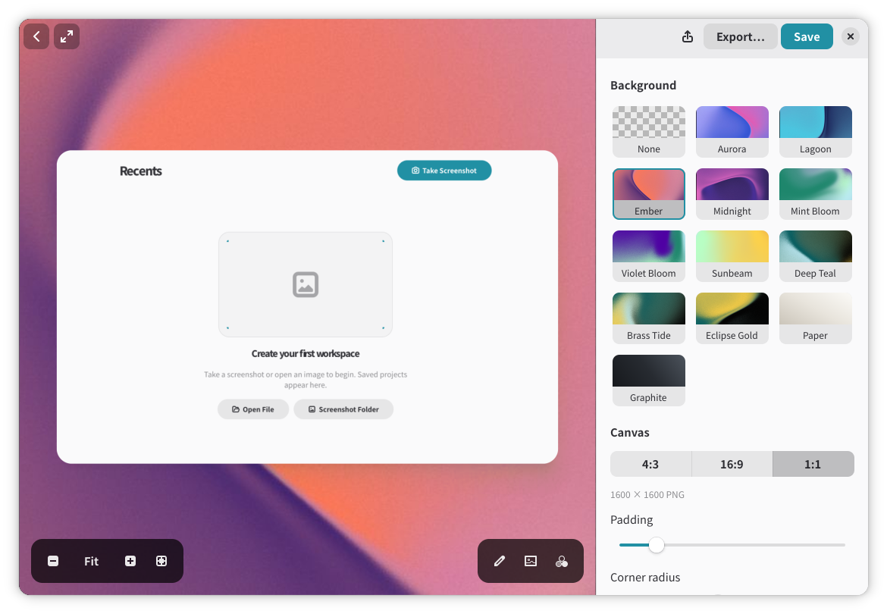

# Bolas

Bolas is a native screenshot capture tool, unified image composer, and video
editor for GNOME, built with GJS, GTK 4, libadwaita, Cairo, and FFmpeg.



## Requirements

- GJS with GTK 4 and GdkPixbuf introspection data
- libadwaita 1.6 or newer
- GStreamer codecs for the video formats you want to play
- FFmpeg with the VP9 and Opus encoders for edited video export
- Meson 1.2 or newer
- Ninja
- Bun (development tooling only)

On Fedora, the native dependencies are provided by packages such as `gjs`,
`gtk4`, `libadwaita`, `ffmpeg-free`, `meson`, and `ninja-build`. Development or
packaging environments may also need the corresponding `-devel` packages.

## Start developing

```sh
bun install
bun run check
bun run run
```

Open a file directly from the source tree with:

```sh
bun run run -- /path/to/screenshot.png
bun run run -- /path/to/recording.webm
bun run run -- /path/to/project.bolas
gjs -m src/main.js
```

## Build and stage an install

```sh
meson setup build
meson compile -C build
DESTDIR="$PWD/stage" meson install -C build
```

The installed command is `bolas`. The desktop entry registers common image and
video MIME types plus the Bolas workspace MIME type so screenshots, recordings,
and `.bolas` projects can be opened from Files and other GNOME applications.

## Debian and RPM packages

The **Build packages** GitHub Actions workflow builds `.deb` (`all`) and Fedora
`.rpm` (`noarch`) packages on pushes to `main`, pull requests targeting `main`,
`v*` tags, and manual runs. Download **bolas-packages** from the workflow run's
artifacts; it contains both packages and `SHA256SUMS`.

Build locally with `bash scripts/package.sh`, then verify the outputs with
`bash tests/test-packages.sh`. Packages are written to `dist/`. See
[native packaging](docs/implementation/packaging.md) for dependencies, version
rules, and installation instructions.

## Flatpak

The development manifest targets the GNOME 49 runtime:

```sh
flatpak-builder --user --install --force-clean \
  .flatpak-build build-aux/io.github.stonega.Bolas.json
```

The application ID is `io.github.stonega.Bolas`. Keep it stable after public
distribution so desktop identity and settings remain continuous.

## Repository map

- `src/`: native GJS application shell, home page, and media drawer
- `src/editor/`: non-destructive image/canvas documents, composition renderer, and unified editor UI
- `src/video/`: non-destructive multitrack video/audio state, timeline, and share workspace
- `src/share/`: shared background presets, controls, and deterministic painters
- `src/services/`: focused screenshot-capture and desktop-handoff services
- `data/`: desktop entry, D-Bus activation, and application icon
- `build-aux/`: Flatpak manifest and native package metadata
- `tests/`: deterministic model and renderer tests
- `docs/`: architecture, setup, and user documentation
